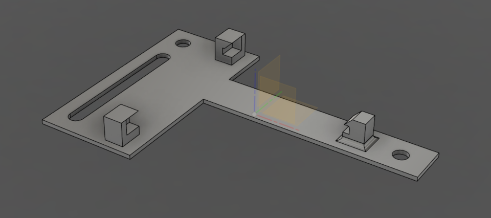

# 3D Printed Parts

This folder contains **3D printable files** used in this project.

The parts are designed to support the hardware assembly, protection, and mounting of the boards and modules into vending machines.

---

## 📁 Folder Structure

Each subfolder should represent a **single printed part** and contain:

- **STL files** (`.stl`) – ready for slicing and printing  
- **STEP files** (`.step`) – editable CAD source (if available)  
- **README.md** – optional notes specific to the part (orientation, tolerances, etc.)

## MDB-Slave
Within the `mdb-slave` folder.

Designed with Fusion360

