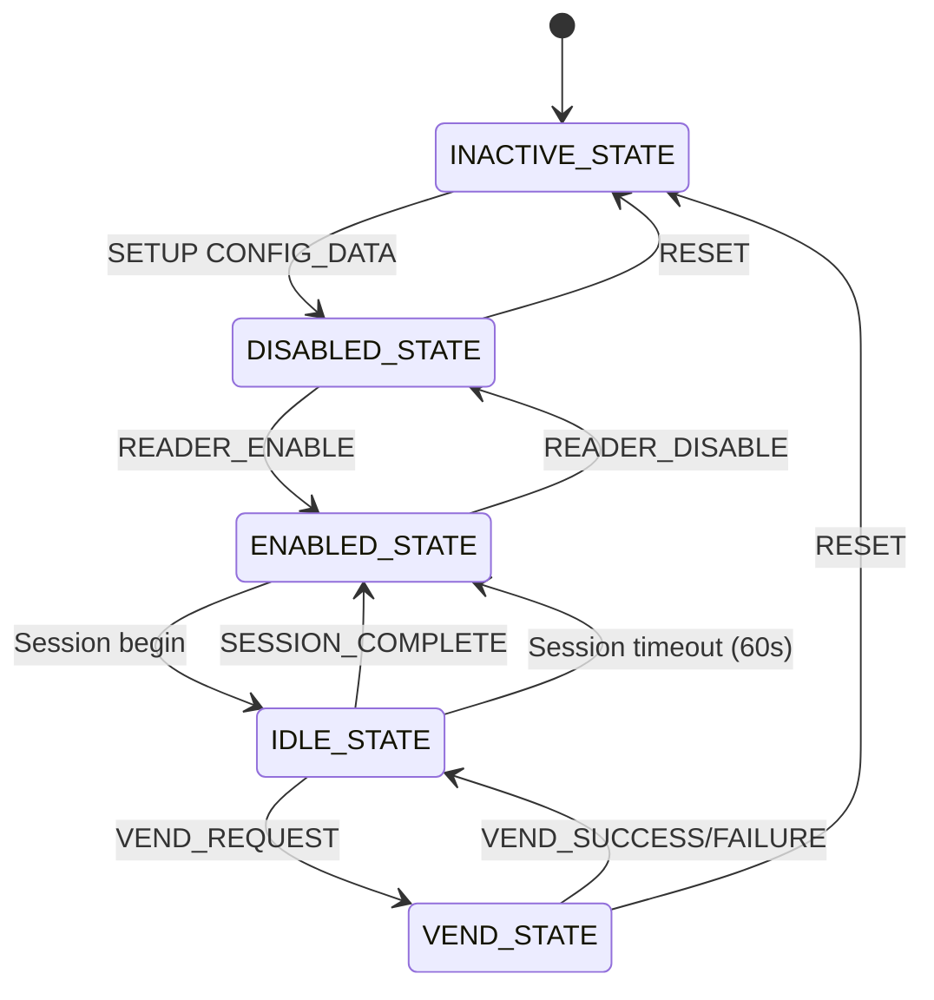

# MDB Slave ESP32-S3

## Overview

This project implements an MDB (Multi-Drop Bus) slave device for vending machines using an ESP32-S3 microcontroller. It enables cashless transactions by interfacing with vending machine controllers (VMC) via the MDB protocol, while providing remote configuration and control through Bluetooth Low Energy (BLE) and MQTT communication. The device also supports telemetry data collection using DEX and DDCMP protocols.

The system acts as a peripheral in the MDB network, handling vending requests, managing payment sessions, and relaying data to cloud services. Key features include secure communication via XOR encryption, state-based vending logic, and periodic telemetry reporting.

## Architecture

The MDB Slave ESP32-S3 implements a multi-layered architecture for cashless vending integration:

```
┌─────────────────────────────────────────────────────────────┐
│                    External Interfaces                       │
├─────────────────────────────────────────────────────────────┤
│ BLE App/Mobile ── BLE GATT ── ESP32-S3 Peripheral           │
│ Vending Machine ── MDB UART ── ESP32-S3 Slave               │
│ Cloud Services ── MQTT/WiFi ─ ESP32-S3 Client               │
│ Vending Machine ── DEX/DDCMP ─ ESP32-S3 Reader              │
└─────────────────────────────────────────────────────────────┘
┌─────────────────────────────────────────────────────────────┐
│                   ESP32-S3 Core Components                   │
├─────────────────────────────────────────────────────────────┤
│ ┌─────────────┐ ┌─────────────┐ ┌─────────────┐ ┌─────────┐ │
│ │ MDB Handler │ │ BLE Stack  │ │ MQTT Client │ │Telemetry│ │
│ │             │ │ (NimBLE)    │ │             │ │ Reader  │ │
│ └─────────────┘ └─────────────┘ └─────────────┘ └─────────┘ │
├─────────────────────────────────────────────────────────────┤
│ ┌─────────────┐ ┌─────────────┐ ┌─────────────┐             │
│ │ State       │ │ Encryption  │ │ UART       │             │
│ │ Machine     │ │ Engine      │ │ Drivers    │             │
│ └─────────────┘ └─────────────┘ └─────────────┘             │
├─────────────────────────────────────────────────────────────┤
│ FreeRTOS Tasks: mdb_cashless_loop, bleprph_host_task, etc. │
└─────────────────────────────────────────────────────────────┘
```

### Communication Flow
1. **Configuration Phase**: BLE app configures device domain, passkey, and WiFi
2. **Session Initiation**: MQTT sends credit, BLE notifies session start
3. **Vending Process**: VMC sends MDB vend request → ESP32 validates funds → BLE app approves → MDB responds
4. **Telemetry**: Periodic DEX/DDCMP data collection and MQTT publishing

### Hardware Interfaces
- **UART2 (MDB)**: GPIO4 RX, GPIO5 TX, 9600 baud, 9-bit protocol
- **UART1 (Telemetry)**: GPIO43 TX, GPIO44 RX, 9600/2400 baud
- **BLE**: Custom GATT service for control and notifications
- **WiFi/MQTT**: Cloud connectivity for remote management
- **LED**: GPIO21 for MDB status indication

## Components

### MDB Handler (`mdb_cashless_loop`)
Core function that implements the MDB slave protocol. Runs in a FreeRTOS task and processes incoming MDB commands from the VMC.

**Key Responsibilities:**
- Receive and parse MDB commands via UART2
- Validate checksums on incoming data
- Manage vending machine state transitions
- Handle vending requests, approvals, and completions
- Send appropriate responses back to VMC

### BLE Peripheral (NimBLE)
Implements Bluetooth Low Energy peripheral functionality using the NimBLE stack.

**Services:**
- Custom GATT service with UUID `020012ac-4202-78b8-ed11-da4642c6bbb2`
- Characteristic for read/write/notify with UUID `020012ac-4202-78b8-ed11-de46769cafc9`

**Functions:**
- `startBleDevice()`: Initializes BLE with device name and callback
- `sendBleNotification()`: Sends notifications to connected BLE clients
- `renameBleDevice()`: Updates device name and restarts advertising

### MQTT Client
Handles cloud connectivity for remote control and data publishing.

**Configuration:**
- Broker: `mqtt://mqtt.vmflow.xyz`
- Topics: `/domain/{subdomain}/#` for subscriptions
- LWT: `/domain/{subdomain}/status` with "offline" message

**Key Events:**
- Publishes sales data on `/domain/{subdomain}/sale`
- Publishes telemetry data on `/domain/{subdomain}/dex`
- Receives credit additions on `/domain/{subdomain}/credit`

### Telemetry Reader
Collects vending machine data using DEX and DDCMP protocols over UART1.

**Protocols Supported:**
- DEX (9600 baud): Standard vending telemetry protocol
- DDCMP (2400 baud): Alternative telemetry protocol

**Functions:**
- `readTelemetryDEX()`: Implements DEX handshake and data transfer
- `readTelemetryDDCMP()`: Implements DDCMP protocol with CRC validation
- `requestTelemetryData()`: Orchestrates telemetry collection and MQTT publishing

### State Machine
Manages the vending machine's operational states using a finite state machine.

**States:**
- `INACTIVE_STATE`: Initial/reset state
- `DISABLED_STATE`: Reader disabled by VMC
- `ENABLED_STATE`: Reader enabled, ready for sessions
- `IDLE_STATE`: Session active, waiting for vend requests
- `VEND_STATE`: Vend in progress

**Transitions:**
- RESET command → INACTIVE_STATE
- SETUP CONFIG_DATA → DISABLED_STATE
- READER_ENABLE → ENABLED_STATE
- Session begin → IDLE_STATE
- VEND_REQUEST → VEND_STATE
- VEND_SUCCESS/FAILURE → IDLE_STATE

**State Machine Diagram:**


## Communication Protocols

### MDB Protocol
9-bit UART communication at 9600 baud with even parity.

**Command Structure:**
- Address byte (bit 8 = mode, bits 6-0 = address)
- Command byte
- Data bytes (variable length)
- Checksum byte

**Supported Commands:**
- RESET (0x00): Reset cashless device
- SETUP (0x01): Configuration (CONFIG_DATA, MAX_MIN_PRICES)
- POLL (0x02): Status polling and response handling
- VEND (0x03): Vending operations (REQUEST, CANCEL, SUCCESS, FAILURE, etc.)
- READER (0x04): Reader control (ENABLE, DISABLE, CANCEL)
- EXPANSION (0x07): Peripheral ID request

### BLE GATT
Custom service for device configuration and vending control.

**Characteristic Usage:**
- Write: Receive commands from BLE app (domain, passkey, WiFi config, vending approvals)
- Notify: Send vending requests and status updates to BLE app

### MQTT
JSON-like payloads with XOR encryption using passkey.

**Payload Format:**
- Byte 0: Command type
- Bytes 1-17: XOR-encrypted data (version, price, item number, timestamp)
- Byte 18: Checksum

**Encryption:**
```c
for(int x = 0; x < sizeof(my_passkey); x++){
    payload[x + 1] ^= my_passkey[x];
}
```

### DEX/DDCMP Telemetry
Proprietary protocols for vending machine data collection.

**DEX Features:**
- Handshake with ENQ/DLE sequences
- CRC-16 validation
- Block-based data transfer

**DDCMP Features:**
- Start sequence with SOH control bytes
- CRC-16 per message
- Acknowledgment-based flow control

## Key Functions

### Core MDB Functions
- `mdb_cashless_loop()`: Main MDB processing loop
- `write_payload_9()`: Send MDB responses with checksum
- `write_9()`: Transmit single byte with parity manipulation

### Encryption/Decryption
- `xorDecodeWithPasskey()`: Validate and decrypt incoming payloads
- `xorEncodeWithPasskey()`: Encrypt outgoing payloads with timestamp validation

### BLE Event Handling
- `ble_event_handler()`: Process BLE characteristic writes
- `mqtt_event_handler()`: Handle MQTT messages and events
- `wifi_event_handler()`: Manage WiFi connectivity

### Telemetry
- `calc_crc_16()`: CRC-16 calculation for telemetry protocols
- `readTelemetryDEX()`: DEX protocol implementation
- `readTelemetryDDCMP()`: DDCMP protocol implementation

## Detailed Function Descriptions

### MDB Core Functions

**`mdb_cashless_loop()`**
Main FreeRTOS task handling MDB protocol communication. Continuously reads UART2 for incoming MDB commands, validates checksums, and processes commands based on current machine state. Implements the slave-side MDB protocol with proper timing and acknowledgment handling.

**`write_payload_9()`**
Transmits MDB response packets with automatic checksum calculation. Takes a payload buffer and length, calculates checksum using sum of all bytes, and sends using 9-bit UART protocol.

**`write_9()`**
Low-level function for transmitting single bytes in MDB 9-bit format. Manipulates UART parity bit to encode the mode bit (bit 8) based on the data byte's parity and the mode flag.

### Security Functions

**`xorDecodeWithPasskey()`**
Decrypts and validates incoming payloads from BLE or MQTT. Performs XOR decryption with the stored passkey, validates checksum, and checks timestamp freshness (within 8 seconds). Returns decoded item price and number if valid.

**`xorEncodeWithPasskey()`**
Encrypts outgoing payloads for secure transmission. Generates random padding, embeds item price/number and timestamp, calculates checksum, then XOR encrypts with passkey.

### BLE Functions

**`ble_event_handler()`**
Processes BLE characteristic write events. Handles various command types (0x00-0x07) for device configuration, session management, and WiFi setup. Stores configuration in NVS and triggers appropriate actions.

**`sendBleNotification()`**
Sends GATT notifications to connected BLE clients. Checks connection state and notification subscription before transmitting data buffers.

### MQTT Functions

**`mqtt_event_handler()`**
Handles MQTT client events including connection, disconnection, and message reception. Processes credit addition messages on `/domain/{subdomain}/credit` topic after XOR decryption and validation.

### Telemetry Functions

**`readTelemetryDEX()`**
Implements DEX protocol handshake and data transfer. Performs ENQ/DLE handshake, sends communication ID and operation request, then receives data blocks with CRC validation. Stores received data in ring buffer.

**`readTelemetryDDCMP()`**
Implements DDCMP protocol with CRC-protected message exchange. Sends start sequence, negotiates communication parameters, requests audit data, and receives multi-packet responses with acknowledgment.

**`requestTelemetryData()`**
Orchestrates telemetry collection by calling DEX and DDCMP readers, then publishes collected data to MQTT `/domain/{subdomain}/dex` topic.

## Data Structures

### Enums
```c
enum MDB_COMMAND { RESET, SETUP, POLL, VEND, READER, EXPANSION };
enum MDB_SETUP_FLOW { CONFIG_DATA, MAX_MIN_PRICES };
enum MDB_VEND_FLOW { VEND_REQUEST, VEND_CANCEL, VEND_SUCCESS, VEND_FAILURE, SESSION_COMPLETE, CASH_SALE };
enum MDB_READER_FLOW { READER_DISABLE, READER_ENABLE, READER_CANCEL };
enum MDB_EXPANSION_FLOW { REQUEST_ID, DIAGNOSTICS };
typedef enum MACHINE_STATE { INACTIVE_STATE, DISABLED_STATE, ENABLED_STATE, IDLE_STATE, VEND_STATE } machine_state_t;
```

### Global Variables
- `machine_state`: Current vending state
- `fundsAvailable`: Available credit for transactions
- `my_subdomain`: Device domain for MQTT topics
- `my_passkey`: 18-byte encryption key
- Control flags: `session_begin_todo`, `vend_approved_todo`, etc.

### Queues and Buffers
- `mdbSessionQueue`: FreeRTOS queue for session management
- `dexRingbuf`: Ring buffer for telemetry data
- UART buffers for RX/TX operations

## Validations and Logic

### Checksum Validation
All MDB messages include checksum validation:
```c
uint8_t chk = 0x00;
for(int x = 0; x < (available_rx - 1); x++)
    chk += mdb_payload_rx[x];
if(chk != mdb_payload_rx[available_rx - 1]) {
    // Invalid checksum
}
```

### State-Based Logic
Vending operations only proceed in appropriate states:
- Vend requests only processed in IDLE_STATE
- Approvals only accepted in VEND_STATE
- Session timeouts after 60 seconds of inactivity

### Fund Validation
```c
if(fundsAvailable && (fundsAvailable != 0xffff)) {
    if (itemPrice <= fundsAvailable) {
        vend_approved_todo = true;
    } else {
        vend_denied_todo = true;
    }
}
```

### Time-Based Security
Payloads include timestamps validated within 8-second window to prevent replay attacks.

### UART Parity Manipulation
Uses parity bit to encode mode information for MDB 9-bit protocol.

## Technical Specifications

### Programming Language
- **Primary Language**: C (C99 standard)
- **Framework**: ESP-IDF v5.x (Espressif IoT Development Framework)
- **RTOS**: FreeRTOS for task management and synchronization
- **BLE Stack**: NimBLE (Apache Mynewt BLE implementation)
- **Build System**: CMake-based build system via ESP-IDF

### Hardware Platform
- **Microcontroller**: ESP32-S3 (dual-core Xtensa LX7, up to 240MHz)
- **Memory**: 512KB SRAM, 8MB PSRAM (optional), 8MB flash
- **Wireless**: WiFi 802.11b/g/n, Bluetooth 5.0 with BLE
- **Peripherals**: UART, GPIO, I2C, SPI, ADC, PWM
- **Power**: 3.3V operation, low-power modes supported

### Runtime Environment
- **Execution Context**: Bare-metal embedded system on ESP32-S3
- **Deployment Target**: Vending machine MDB bus integration
- **Operating System**: FreeRTOS real-time kernel
- **Network Stack**: LwIP for TCP/IP and MQTT over WiFi
- **Storage**: NVS (Non-Volatile Storage) for configuration persistence

### Installation and Deployment
- **Build Process**: Compiled with ESP-IDF toolchain (GCC-based)
- **Flashing**: Via USB-UART (CP210x/FTDI) or JTAG (OpenOCD)
- **Configuration**: Runtime configuration via BLE or MQTT
- **Physical Installation**: Integrated into vending machine electronics, connected to MDB bus and telemetry ports
- **Power Source**: Vending machine power supply (typically 24V DC converted to 3.3V)

### Performance Characteristics
- **CPU Usage**: Multi-tasking with dedicated cores for MDB processing
- **Memory Footprint**: ~100KB RAM for runtime, ~500KB flash for code
- **Real-time Requirements**: MDB protocol demands <5ms response times
- **Power Consumption**: Active mode ~100mA, sleep modes available

## Dependencies

- ESP-IDF v5.x: Core framework for ESP32
- NimBLE: Bluetooth Low Energy stack
- FreeRTOS: Real-time operating system
- MQTT Client: ESP-IDF MQTT component
- NVS Flash: Non-volatile storage for configuration

## Configuration

### Build Configuration
- UART2: GPIO 4 (RX), GPIO 5 (TX) for MDB
- UART1: GPIO 43 (TX), GPIO 44 (RX) for telemetry
- LED: GPIO 21 for MDB status indication

### Runtime Configuration via BLE
- Domain/Subdomain
- Passkey for encryption
- WiFi SSID/Password
- Vending approvals

### NVS Storage
Persistent storage for domain and passkey using ESP32 NVS.

## Error Handling

- UART read timeouts with `pdMS_TO_TICKS()`
- BLE connection state checks before notifications
- MQTT reconnection on disconnect
- Telemetry protocol fallbacks (DEX then DDCMP)

## Performance Considerations

- MDB loop runs at high priority for real-time response
- Telemetry collection scheduled every 12 hours
- Ring buffer sizing for telemetry data (8KB)
- UART buffer sizes optimized for protocol requirements

This implementation provides a complete cashless vending solution with robust error handling, security features, and multi-protocol support for comprehensive vending machine integration.
