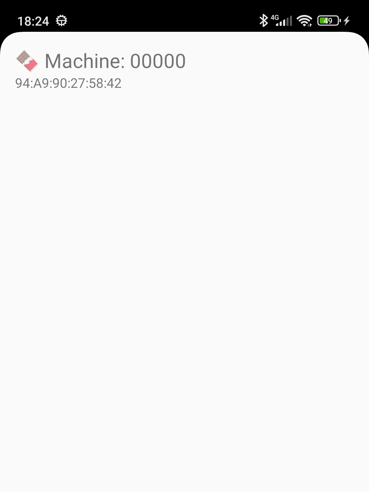

# 📱 Android App – MDB Cashless BLE

This is the Android application for communication with the **ESP32 MDB-Cashless BLE** board. The project is part of the `mdb-esp32-cashless` solution, enabling cashless payment system integration with vending machines via the MDB protocol and Bluetooth Low Energy (BLE) communication. The app serves as a mobile interface to interact with the MDB Cashless device, supporting cashless transactions such as card payments or digital methods.

---

## 📡 Features

- Connect to the **ESP32 MDB-Cashless** board via **Bluetooth Low Energy (BLE)**
- Discover and automatically pair with compatible devices
- Exchange commands and telemetry according to the MDB-Cashless protocol
- Interface to simulate commands and receive responses from the board
  

