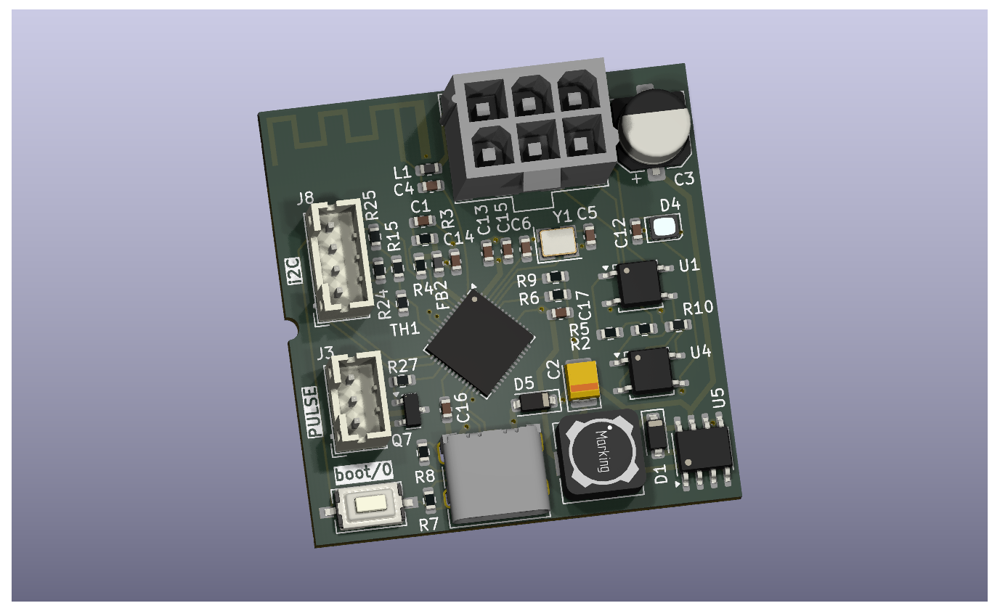
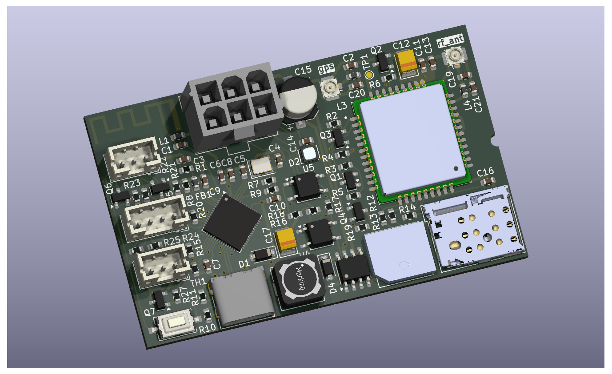
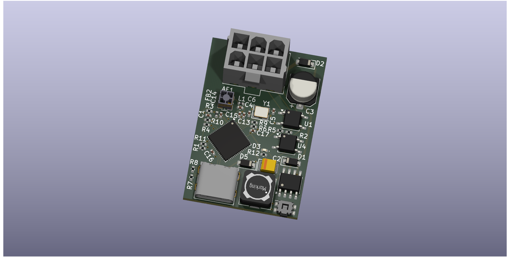
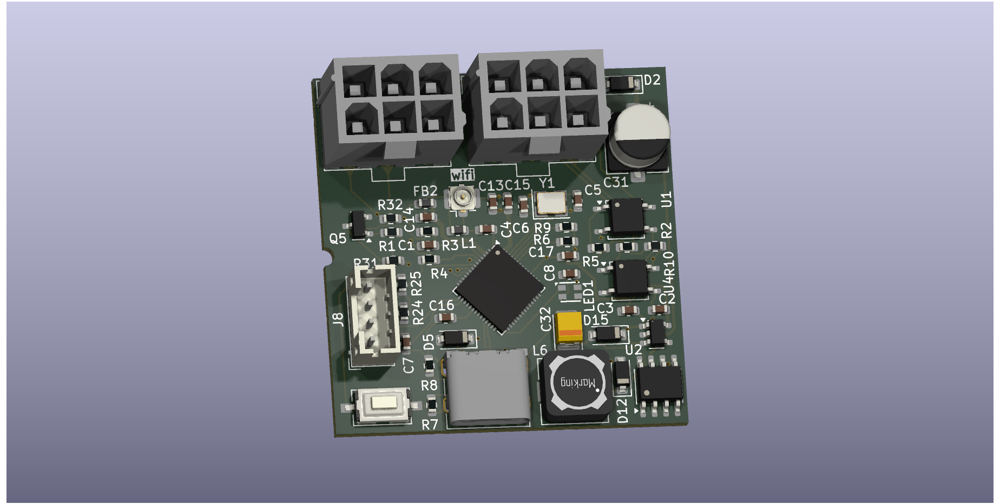

# MDB ESP32 Cashless Devices

This repository contains open hardware projects for MDB-based cashless devices built around the ESP32 platform.

## PCBWay Project Store
You can view and order the PCBs directly from PCBWay using the link below:

👉 https://www.pcbway.com/project/member/?bmbno=1B3B95CB-4E28-4D

---

### MDB ESP32 Cashless Device

[Schematic (PDF)](schematic-mdb-slave-esp32s3.pdf)

### MDB ESP32 GPS/LTE-M/NB-IoT Cashless Device

[Schematic (PDF)](schematic-mdb-slave-esp32s3-sim7080g.pdf)

### MDB ESP32 Cashless Device (Mini, 0402)

[Schematic (PDF)](schematic-mdb-slave-esp32s3-mini.pdf)

### MDB ESP32 Cashless/VMC Device

[Schematic (PDF)](schematic-mdb-bridge-esp32s3.pdf)
