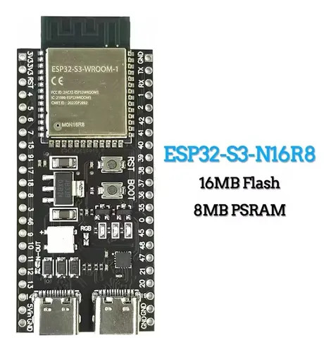

# ESP32 Vending Machine Controller with MDB Bus and EVA DTS Implementation
This project is a comprehensive implementation of a vending machine controller using the ESP32 microcontroller. It integrates support for the Multi-Drop Bus (MDB) protocol to communicate with various vending peripherals (e.g., coin changers, bill validators, cashless payment systems) and incorporates the EVA-DTS (European Vending Association - Data Transfer Standard) for data exchange and telemetry.

