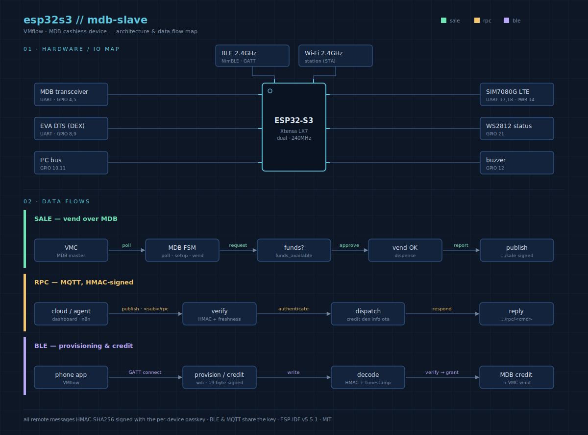

# mdb-slave-esp32s3 — MDB Cashless Slave Firmware

ESP-IDF firmware that turns an **ESP32-S3** into an **MDB (Multi-Drop Bus) cashless device** for vending machines. The board acts as an MDB slave on the cashless peripheral address, granting credit and reporting sales/telemetry over Wi-Fi or cellular.

> This is the device firmware. For the platform overview — dashboard, Android app, Supabase API and AI-agent control — see the [project README](../README.md). For the agent-facing command reference, see [AGENTS.md](../AGENTS.md).




## What it does

- **MDB cashless slave** — implements the cashless device session state machine (reset, setup, poll, vend) and answers the VMC on the configured peripheral address.
- **Connectivity** — Wi-Fi STA, with an optional **SIM7080G** LTE-M/NB-IoT modem (PPP via `esp_modem`) as the cellular path. MQTT broker: `mqtt.vmflow.xyz`.
- **BLE provisioning (NimBLE)** — the VMflow Android app registers the board, configures the Wi-Fi credentials, and sends credit over a signed 19-byte payload.
- **Signed MQTT RPC** — remote control over MQTT, every message authenticated with the per-device passkey (HMAC-SHA256, replay-protected by a freshness window).
- **EVA DTS** — on-demand DEX/DDCMP telemetry read.
- **PAX counter** — periodic BLE scan estimates nearby foot traffic and reports anonymized counts.
- **OTA** — pulls a release image from GitHub over HTTPS (`esp_https_ota`) and reboots into it.

## Connectivity model

The device tries Wi-Fi and the SIM7080G modem for an uplink; whichever comes up carries MQTT. The SIM path also serves the device's own traffic. Wi-Fi credentials arrive via BLE provisioning; the APN and LTE network mode are set in `menuconfig`.

## Agent / RPC interfaces

All MQTT messages are signed: `"<cmd>[:<args>]:<ts>:<hmac_hex>"`, where `hmac = HMAC-SHA256(passkey, everything-before-the-last-colon)` and `<ts>` is Unix seconds, accepted only inside the freshness window.

**Inbound** — topic `<sub>.vmflow.xyz/rpc`:

| Command | Action |
|---------|--------|
| `dex` | trigger an on-demand DEX/telemetry read |
| `info` | publish device snapshot JSON on `.../rpc/info` |
| `credit:<amount>` | grant credit (amount scaled to 1/100 units) |
| `oos` | send MDB "command out of sequence" to the VMC |
| `echo` | reply `<ts>` on `.../rpc/echo` (liveness + RTT probe) |
| `buzzer` | 1 s beep |
| `restart` | ack on `.../rpc/restart`, then reboot |
| `ota[:<tag>]` | pull app image from a GitHub release (latest, or pinned tag), then reboot |

**Outbound** — signed `"<fields>:<ts>:<hmac_hex>"`:

| Topic | Payload |
|-------|---------|
| `.../sale` | `<price>:<item>:<ts>:<hmac>` |
| `.../paxcounter` | `<count>:<ts>:<hmac>` |
| `.../status` | retained `online` / `offline` (LWT) |

**BLE wire payload (phone app)** — 19 bytes:

```
[0] CMD | [1-4] PRICE u32 | [5-6] ITEM u16 | [7-10] TIME u32 |
[11-14] reserved=0 | [15-18] HMAC-SHA256(passkey, bytes 0-14)[:4]
```

Multi-byte fields are big-endian; see `read_u32`/`write_u32` in `main/mdb-slave-esp32s3.c`.

## Pinout (ESP32-S3)

| GPIO | Signal | Function |
|------|--------|----------|
| 4 | `PIN_MDB_RX` | MDB UART RX (from VMC) |
| 5 | `PIN_MDB_TX` | MDB UART TX (to VMC) |
| 21 | `PIN_MDB_LED` | WS2812 status LED (`led_strip`) |
| 8 | `PIN_DEX_RX` | EVA DTS / DEX UART RX |
| 9 | `PIN_DEX_TX` | EVA DTS / DEX UART TX |
| 18 | `PIN_SIM7080G_RX` | SIM7080G UART RX |
| 17 | `PIN_SIM7080G_TX` | SIM7080G UART TX |
| 14 | `PIN_SIM7080G_PWR` | SIM7080G power key |
| 12 | `PIN_BUZZER_PWR` | Buzzer (SIM7080G board variant) |
| 10 | `PIN_I2C_SDA` | I²C SDA |
| 11 | `PIN_I2C_SCL` | I²C SCL |
| 13 | `PIN_PULSE_1` | Pulse interface |

Pin assignments live in `main/mdb-slave-esp32s3.c` (and `main/eva-dts.c` for the DEX UART).

## Build & flash

Requires **ESP-IDF v5.5.1**. Managed components (`led_strip`, `esp_modem`) are pulled by the component manager on first build.

```bash
idf.py set-target esp32s3
idf.py build
idf.py -p <PORT> flash monitor
```

For end users, the prebuilt image is available via the Web Installer: **https://install.vmflow.xyz**

## Configuration (`idf.py menuconfig`)

Under **VMflow →**:

- **MDB Cashless Device** — peripheral address (#1 `0x10` / #2 `0x60`), currency code, scale factor, decimal places.
- **SIM7080G** — LTE network mode (Cat-M / NB-IoT / both) and APN.

## Source layout

| File | Role |
|------|------|
| `main/mdb-slave-esp32s3.c` | MDB state machine, Wi-Fi/modem bring-up, MQTT RPC, OTA, app entry |
| `main/nimble.c` / `nimble.h` | BLE (NimBLE) provisioning, credit, PAX counter |
| `main/eva-dts.c` | EVA DTS DEX/DDCMP telemetry |
| `main/rpc_auth.c` / `rpc_auth.h` | HMAC-SHA256 signing & verification for RPC and BLE |
</content>
